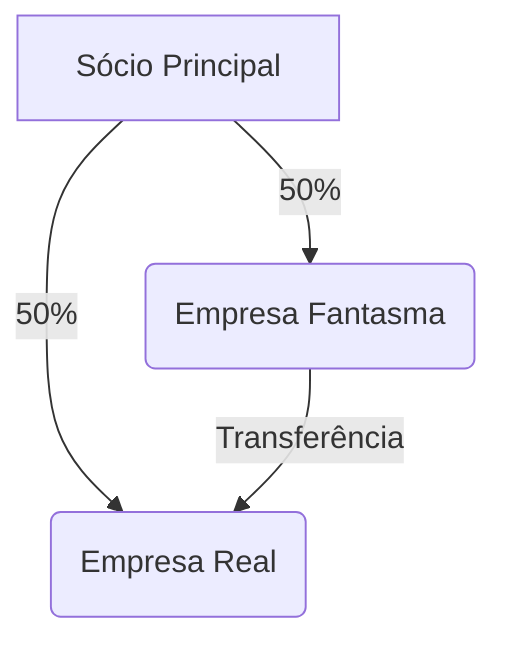

# Auditoria

Comece a digitar as suas constatações de auditoria aqui...

## Dados do contribuinte

```sfia-sql
SELECT nome, cnpj, ie FROM _fiscal_participantedeclarado WHERE idParticipanteDeclarado = 1;
```

* Referência inicial de importação: `sfia-sql SELECT substr(min(referencia), 1, 7) FROM _imp_ReferenciasSelecionadasNaImportacao AS A;`
* Referência final de importação: `sfia-sql SELECT substr(max(referencia), 1, 7) FROM _imp_ReferenciasSelecionadasNaImportacao AS A;`

## 2. Resumo Econômico

```sfia-sql
SELECT g1,
  sum(valconGia) AS valconGia, sum(valconEfd) AS valconEfd,
  sum(valconDif) AS valconDif,
  sum(icmsGia)   AS icmsGia,   sum(icmsEfd)   AS icmsEfd
FROM madf
GROUP BY g1;
```

## 3. Constatações do Auditor

> [!warning] Ponto de Atenção
> Inserir aqui as constatações sobre os dados acima.

## Valores conforme GIAs (Operação Própria)

```sfia-sql
SELECT min(aaaamm) || ' a ' || max(aaaamm) AS periodo, sum(c51), sum(c56), sum(sdoOper), sum(c52), sum(c53), sum(c57), sum(c58), sum(sdoNOper), sum(c55), sum(c60), sum(c61), sum(c62), sum(c63), sum(c64), sum(c65), sum(c66)
FROM
(WITH UltimaDeclaracao AS ( SELECT cnpj, ie, idTipoDeOperacaoNaGia, dataDeReferencia, MAX(dataDeEntrega) AS dataDeEntrega FROM _fiscal_ApuracaoDeIcmsPelaGia GROUP BY cnpj, ie, idTipoDeOperacaoNaGia, dataDeReferencia ) SELECT SUBSTR(B.dataDeReferencia, 1, 4) || SUBSTR(B.dataDeReferencia, 6, 2) AS aaaamm, B.campo51SaidasComDebito AS c51, B.campo56EntradasComCredito AS c56, ROUND(B.campo51SaidasComDebito - B.campo56EntradasComCredito, 2) AS sdoOper, B.campo52OutrosDebitos AS c52, B.campo53EstornoDeCreditos AS c53, B.campo57OutrosCreditos AS c57, B.campo58EstornoDeDebitos AS c58, ROUND(B.campo52OutrosDebitos + B.campo53EstornoDeCreditos - B.campo57OutrosCreditos - B.campo58EstornoDeDebitos, 2) AS sdoNOper, B.campo55TotalDeDebitos AS c55, B.campo60SubtotalDeCreditos AS c60, B.campo61SaldoCredorDoPeriodoAnterior AS c61, B.campo62TotalDeCreditos AS c62, B.campo63SaldoDevedor AS c63, B.campo64Deducoes AS c64, B.campo65ImpostoARecolher AS c65, B.campo66SaldoCredorATransportar AS c66 FROM UltimaDeclaracao AS sqA LEFT OUTER JOIN _fiscal_ApuracaoDeIcmsPelaGia AS B ON B.cnpj = sqA.cnpj AND B.ie = sqA.ie AND B.idTipoDeOperacaoNaGia = sqA.idTipoDeOperacaoNaGia AND B.dataDeReferencia = sqA.dataDeReferencia AND B.dataDeEntrega = sqA.dataDeEntrega WHERE B.idTipoDeOperacaoNaGia = 0 ORDER BY aaaamm)
```

```sfia
title: "Movimentação por Grupo Econômico"
sql.limit: 2
show_sql: true
```

---

## tabelas que podem auxiliar
> antes usar `vc importador_safic main.py merge --src (...) **--all-tables**`

## _fiscal_Cest e _fiscal_CestSegmento

```sfia-sql
SELECT
  'Cest' AS tCEST, CEST.*,
  'CestSegmento' AS tCESPS, CESTS.*
FROM
_fiscal_Cest AS CEST
LEFT OUTER JOIN _fiscal_CestSegmento AS CESTS ON CESTS.CodigoCestSegmento = CEST.CodigoSegmento
LIMIT 3;
```

## _fiscal_Cnae, _fiscal_CnaeDivisao, _fiscal_CnaeGrupo e _fiscal_CnaeClasse

```sfia-sql
SELECT
  'Cnae' AS tCNAE, CNAE.*,
  'CnaeDivisao' AS tCNAED, CNAED.*,
  'CnaeGrupo' AS tCNAEG, CNAEG.*,
  'CnaeClasse' AS tCNAEC, CNAEC.*
FROM _fiscal_Cnae AS CNAE
LEFT OUTER JOIN _fiscal_CnaeDivisao AS CNAED ON CNAED.codigo = floor(CNAE.codigo/100000)
LEFT OUTER JOIN _fiscal_CnaeGrupo AS CNAEG ON CNAEG.codigo = floor(CNAE.codigo/10000)
LEFT OUTER JOIN _fiscal_CnaeClasse AS CNAEC ON CNAEC.codigo = floor(CNAE.codigo/100)
WHERE CNAE.codigo > 0
LIMIT 4
```

## _fiscal_CodSitDf

```sfia-sql
SELECT * from _fiscal_CodSitDf LIMIT 10;
```

## _fiscal_EfdAjustesDeApuracao

```sfia-sql
SELECT * from _fiscal_EfdAjustesDeApuracao LIMIT 3;
```

## _fiscal_EfdAjustesDeDocFiscal

```sfia-sql
SELECT * from _fiscal_EfdAjustesDeDocFiscal LIMIT 3;
```

## _fiscal_Evt

```sfia-sql
SELECT * from _fiscal_Evt LIMIT 10;
```

## _fiscal_GiaAgregadaEmCfop

```sfia-sql
SELECT * from _fiscal_GiaAgregadaEmCfop LIMIT 1;
```

## _fiscal_Ncm, _fiscal_NcmCapitulo, _fiscal_NcmPosicao, _fiscal_NcmSubposicao e _fiscal_NcmItem

```sfia-sql
SELECT 
  'Ncm' AS tNCM, NCM.*,
  'NcmCapitulo' AS tNCMC, NCMC.*,
  'NcmPosicao' AS tNCMP, NCMP.*,
  'NcmSubPosicao' AS tNCMSP, NCMSP.*,
  'NcmItem' AS tNCMI, NCMI.*
FROM
_fiscal_Ncm AS NCM
LEFT OUTER JOIN _fiscal_NcmCapitulo AS NCMC ON NCMC.CodigoNcmCapitulo = substr(NCM.CodigoNcm, 1, 2)
LEFT OUTER JOIN _fiscal_NcmPosicao AS NCMP ON NCMP.CodigoNcmPosicao = substr(NCM.CodigoNcm, 1, 4)
LEFT OUTER JOIN _fiscal_NcmSubposicao AS NCMSP ON NCMSP.CodigoNcmSubPosicao = substr(NCM.CodigoNcm, 1, 6)
LEFT OUTER JOIN _fiscal_NcmItem AS NCMI ON NCMI.CodigoNcmItem = substr(NCM.CodigoNcm, 1, 7)
LIMIT 5;
```

## _fiscal_Classificacao

```sfia-sql
SELECT * from _fiscal_Classificacao LIMIT 3;
```


## DICA PARA DESCOBRIR RELACIONAMENTOS
* para ajudar a criar LEFT OUTER JOINS

```bash
C:\srcP\vc_0.4.7>vc utils mapeador_sqlite.py map -h
usage: mapeador_sqlite.py map [-h] --src SRC [--dst DST]

options:
  -h, --help  show this help message and exit
  --src SRC   Caminho para o arquivo .sqlite de origem (obrigatório)
  --dst DST   Arquivo .sqlite de destino gerado (padrão: var/mapeamento_chaves.sqlite)

C:\srcP\vc_0.4.7>vc utils mapeador_sqlite.py map --src C:\sef\result\IF\sfia\_estudos\osf.sqlite_all-tables
🗄️  Conectando ao banco de entrada: osf.sqlite_all-tables
💾 Criando/Atualizando banco de saída: mapeamento_chaves.sqlite
 ➔ Extraindo metadados de 1562 tabelas...
 ➔ Calculando cruzamentos de chaves (cid=0 vs cid>0)...
✅ Processamento finalizado! Banco salvo em: C:\srcP\vc_0.4.7\var\mapeamento_chaves.sqlite
💡 DICA: Você agora pode pesquisar os relacionamentos de uma tabela executando:
   vc utils mapeador_sqlite.py search --table NOME_DA_TABELA

C:\srcP\vc_0.4.7>vc utils mapeador_sqlite.py search --table DocAtrib_fiscal_DocAtributos
🔎 INICIANDO PESQUISA PARA A TABELA: `DocAtrib_fiscal_DocAtributos`
============================================================
O objetivo aqui é descobrir qual é a chave primária (primeiro campo) desta tabela
e listar todas as outras tabelas que utilizam este mesmo campo como chave estrangeira.\n
### 1. Busca Direta de Cruzamentos
Primeiro, consultamos a tabela `relacionamentos` para ver quem aponta para `DocAtrib_fiscal_DocAtributos`.\n
**SQL Executado:**\n```sql\nSELECT campo, pk, fk
FROM relacionamentos
WHERE pk = 'DocAtrib_fiscal_DocAtributos'\n```\n
```

| campo | pk | fk |
|---|---|---|
| idDocAtributos | DocAtrib_fiscal_DocAtributos | _impFiscal_DocClassificado |
| idDocAtributos | DocAtrib_fiscal_DocAtributos | _impFiscal_DocClassificadoApuracao |
| idDocAtributos | DocAtrib_fiscal_DocAtributos | _impFiscal_DocClassificadoItem |
| idDocAtributos | DocAtrib_fiscal_DocAtributos | _fiscal_RelDocAtributosItemDfe |
| idDocAtributos | DocAtrib_fiscal_DocAtributos | DocAtrib_fiscal_DocAtributosItem |
| idDocAtributos | DocAtrib_fiscal_DocAtributos | DocAtrib_fiscal_DocClassificadoApuracao |
| idDocAtributos | DocAtrib_fiscal_DocAtributos | DocAtrib_fiscal_DocClassificadoItem |
| idDocAtributos | DocAtrib_fiscal_DocAtributos | DocAtrib_fiscal_DocAtributosDeApuracao |
| idDocAtributos | DocAtrib_fiscal_DocAtributos | DocAtrib_fiscal_DocAtributosDeApuracaoCompleto |
| idDocAtributos | DocAtrib_fiscal_DocAtributos | DocAtrib_impFiscal_DocAtributosItemCompleto |
| idDocAtributos | DocAtrib_fiscal_DocAtributos | DocAtrib_impFiscal_DocAtributosDeApuracaoCompleto |
| idDocAtributos | DocAtrib_fiscal_DocAtributos | DocAtrib_fiscal_DocAtributosItemCompleto |

```bash
### 2. Detalhamento Estrutural das Chaves (PK e FKs)
Agora, vamos visualizar a estrutura física do campo `idDocAtributos`.
O SQL abaixo faz uma UNIÃO (UNION ALL) de duas buscas:
1. Traz a definição oficial do campo onde ele é a Chave Primária (cid = 0).
2. Traz a definição de onde ele aparece como Chave Estrangeira (cid > 0) nas demais tabelas.\n
**SQL Executado:**\n```sql\nSELECT tbl_name, cid, name, type, "notnull", dflt_value, pk
FROM schema_info WHERE tbl_name = 'DocAtrib_fiscal_DocAtributos' AND cid = 0
UNION ALL
SELECT tbl_name, cid, name, type, "notnull", dflt_value, pk
FROM schema_info WHERE name = 'idDocAtributos' AND cid > 0\n```\n
```

| tbl_name | cid | name | type | notnull | dflt_value | pk |
|---|---|---|---|---|---|---|
| DocAtrib_fiscal_DocAtributos | 0 | idDocAtributos | INT | 0 |  | 0 |
| _impFiscal_DocClassificado | 1 | idDocAtributos | INT | 0 |  | 0 |
| _impFiscal_DocClassificadoApuracao | 2 | idDocAtributos | INT | 0 |  | 0 |
| _impFiscal_DocClassificadoItem | 1 | idDocAtributos | INT | 0 |  | 0 |
| _fiscal_RelDocAtributosItemDfe | 1 | idDocAtributos | INT | 0 |  | 0 |
| DocAtrib_fiscal_DocAtributosItem | 1 | idDocAtributos | INT | 0 |  | 0 |
| DocAtrib_fiscal_DocClassificadoApuracao | 4 | idDocAtributos | INT | 0 |  | 0 |
| DocAtrib_fiscal_DocClassificadoItem | 5 | idDocAtributos | INT | 0 |  | 0 |
| DocAtrib_fiscal_DocAtributosDeApuracao | 1 | idDocAtributos | INT | 0 |  | 0 |
| DocAtrib_fiscal_DocAtributosDeApuracaoCompleto | 1 | idDocAtributos | INT | 0 |  | 0 |
| DocAtrib_impFiscal_DocAtributosItemCompleto | 1 | idDocAtributos | INT | 0 |  | 0 |
| DocAtrib_impFiscal_DocAtributosDeApuracaoCompleto | 1 | idDocAtributos | INT | 0 |  | 0 |
| DocAtrib_fiscal_DocAtributosItemCompleto | 1 | idDocAtributos | INT | 0 |  | 0 |

```bash
✅ Pesquisa concluída com sucesso!\n
```

*Gerado por sfia*

*Variável main_db: {{ main_db }}, attach_dbs: {{ attach_dbs }}*

### [Emojies](https://github.com/markdown-it/markdown-it-emoji)
## Classic markup: :wink: :cry: :laughing: :yum:
## Shortcuts (emoticons): :-) :-( 8-) ;)
## ✅🆗 Ok ✔️☑️"check" 👌 está tudo bem 👍 joinha
## ❌✖️ erro 🚫 proibido
## ⚠️ aviso 👎 deu errado
Outros emojis:
## 🎯🚀💡🧹🪄🎉📆📈📉🚹🚺
## 🗑️📎📌✒️🔍🔒🔓🚫❗❓⁉️
## 👉👆👈👇⬅️➡️⬆️⬇️↙️↖️↗️↘️🔀🔁🔄
## ➕➖✖️➗🟰♾️✔️☑️

## Callouts / Admonitions

> [!warning] Constatação Crítica
> A empresa **não apresentou** as notas fiscais do mês de Abril/2023.
> O auditor recomenda checagem cruzada :mag:

> [!note] A note banner

> [!abstract] An abstract banner

> [!info] A info banner

> [!tip] A tip banner

> [!success] A success banner

> [!question] A question banner

> [!warning] A warning banner

> [!failure] A failure banner

> [!danger] A danger banner

> [!bug] A bug banner

> [!example] An example banner

> [!quote] A quote banner


## Passos da Auditoria
- [x] Extrair dados do SQLite local
- [ ] Checar valores contra o arquivo XML
- [ ] Entrevistar o contador responsável

Foi constatada uma divergência de ==R$ 450.000,00== na conta de fornecedores[^1].

## Fluxograma Societário


[^1]: Conforme apurado no banco `sia13003713267.sqlite`, tabela `notas_fiscais`.
